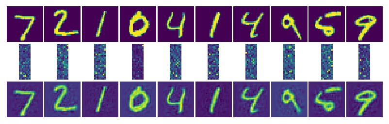
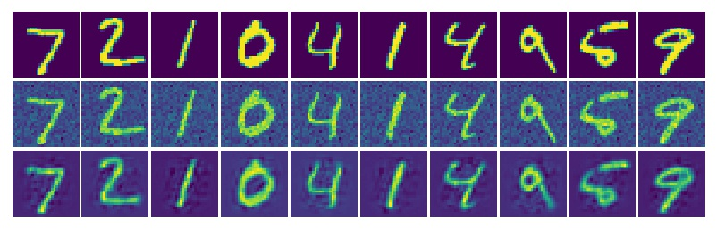
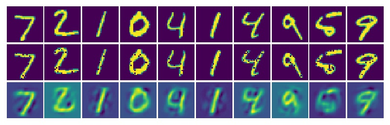
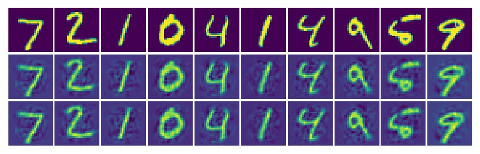
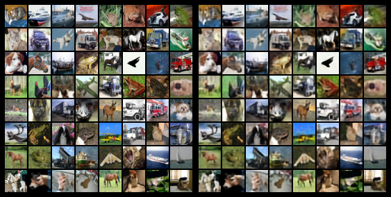

# 用TensorFlow实现各种自编码

### 自编码 ae.py / ae2.py
> 链接 : [自编码1](ae.py)  [自编码2](ae2.py)

### 高斯噪声自编码 ae_gaussian.py
> 链接 ： [高斯噪声自编码](ae_gaussian.py)

### 掩码噪声自编码 ae_masking.py
> 链接 ： [掩码噪声自编码](ae_masking.py)

### 堆栈自编码 ae_stack.py / ae_stack2.py
> 链接 ： [堆栈自编码1](ae_stack.py)   [堆栈自编码2](ae_stack2.py)

### 变分自编码 
> 链接 ： [变分自编码](ae_variational.py)

### Cifar10 Demo

> 链接 ： [PyTorch Cifar10](torch_ae_cifar10.py)

